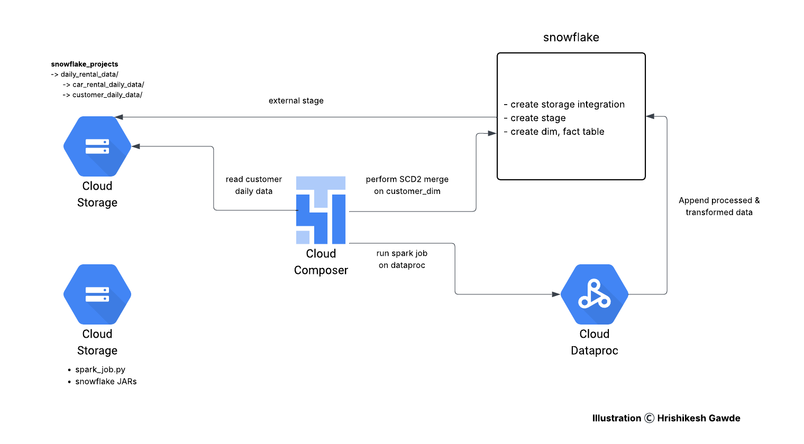
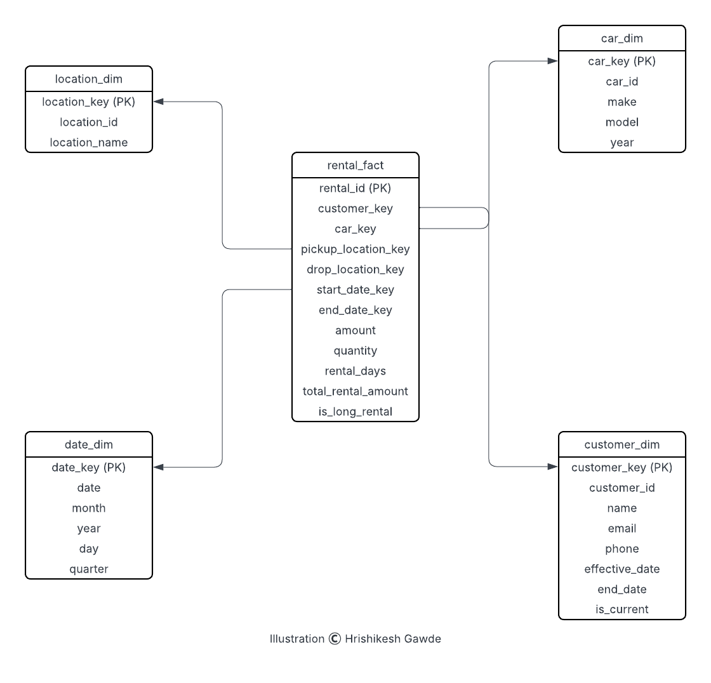

# Car Rental Data Batch Ingestion with SCD2 Merge in Snowflake
This project demonstrates a batch-based data ingestion pipeline for a car rental business using Google Cloud Platform and Snowflake. It involves daily ingestion of car rental and customer data from Cloud Storage, transformation via PySpark on Dataproc, and SCD2 (Slowly Changing Dimension Type 2) merge logic for maintaining a historical customer dimension. The entire workflow is orchestrated using Cloud Composer (Airflow).

## Problem Statement
- Businesses in the car rental domain deal with rapidly changing customer and rental information. Maintaining historical accuracy for analytical reporting, especially for customer data, is essential. This project addresses the need for:
- Automating daily ingestion of car rental data.
- Preserving historical changes in customer records.
- Efficient transformation and loading of clean, enriched fact data into a data warehouse.

## Architecture

## Technology Used
- Python
- PySpark
- Google Cloud Dataproc
- Google Cloud Storage
- Google Cloud Composer (Airflow)
- Snowflake

## Dataset Used
The daily datasets used for ingestion include:
- customer_daily_data (CSV): customer_id, name, email, phone
- car_rental_daily_data (JSON): rental_id, customer_id, car_id, pickup_location_id, drop_location_id, start_date, end_date, amount, quantity

## Data Model
#### Star Schema:
- Fact Table: rental_fact
- Dimensions: customer_dim (SCD2), car_dim, location_dim, date_dim

## Scripts for Project
#### spark_job.py: 
PySpark script that:
- Reads dimension tables and rental fact table from Snowflake.
- Performs data validation and transformation.
- Derives the following columns: rental_duration_days, total_rental_amount, average_daily_rental_amount, is_long_rental
- Appends transformed data into rental_fact.

#### car_rental_airflow_dag.py: 
Airflow DAG that:
- Accepts date as a parameter for dynamic ingestion.
- Reads daily customer and car_rental files from GCS.
- Performs SCD2 merge on customer_dim in Snowflake.
- Triggers the PySpark job on a Dataproc cluster.

## Output
- SCD2 Implementation: Historical tracking of customer changes in the customer_dim table with effective_date, end_date, and is_current columns.
- Transformed Fact Table: Enriched rental_fact table with calculated metrics improves downstream analytical capabilities.
- Star Schema: Designed for optimal analytical querying using Snowflake.
- Parameterized Orchestration: Enables backfilling or replaying data for any date with simple overrides.

## Buisness Impact
By deriving key metrics such as rental_duration_days, total_rental_amount, average_daily_rental_amount, and is_long_rental, the pipeline enables the car rental business to gain actionable insights into customer behavior and rental patterns. These insights support data-driven decisions around pricing strategies, customer segmentation, inventory planning, and marketing campaigns, ultimately helping to optimize revenue and enhance customer experience.

## My Learnings
- Implemented SCD2 merge logic in Snowflake using PySpark and SQL MERGE.
- Built a parameterized, automated ingestion pipeline triggered via Cloud Composer.
- Gained hands-on experience with PySpark transformations, GCP Dataproc orchestration, and Snowflake table design.
- Learned how to design and populate a dimensional model (star schema) from semi-structured and structured source files.
- Improved confidence in managing batch pipelines with production-ready modular code.

  
